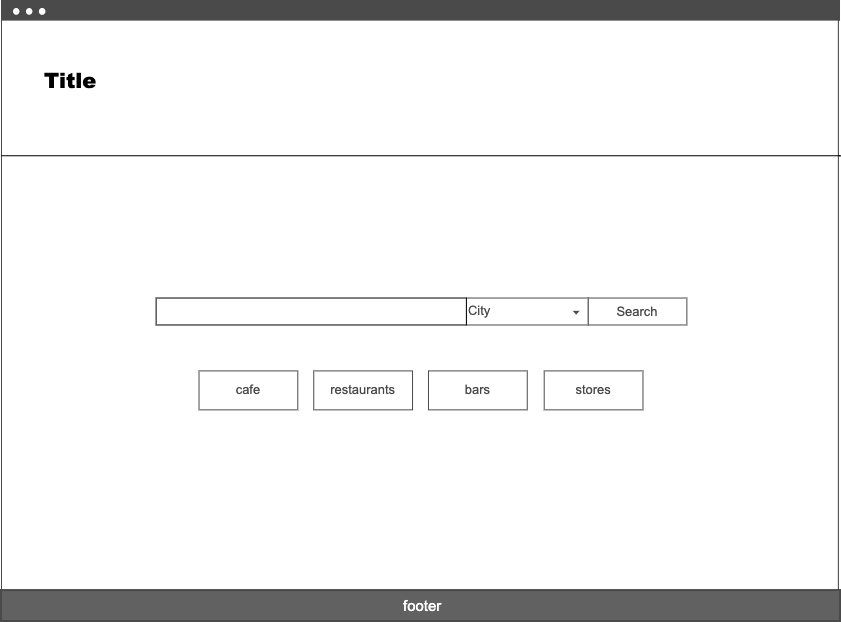
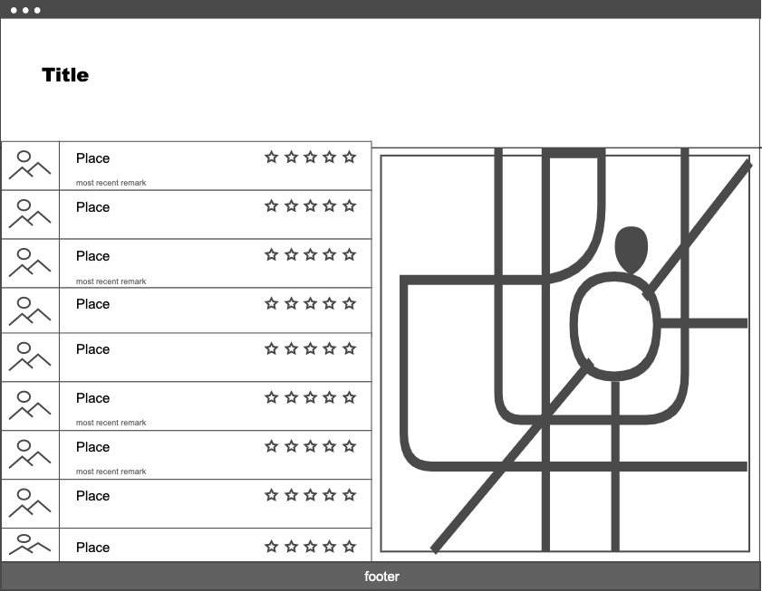
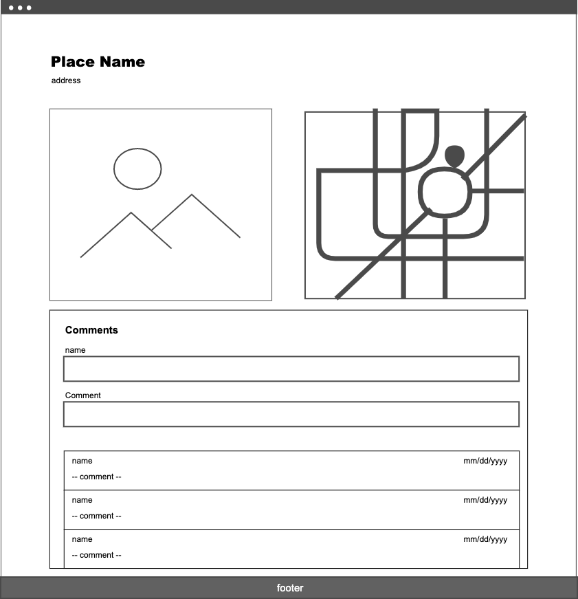

# GA-SEI-Project-Purlieu

Purlieu is a local search and discovery app that provides recommendations of places to go nearby. 

### Technologies used

* Javascript
* React
  - React Routers
  - React Select
  - React Bootstrap
* Third party API's:
  - Google Maps
  - Google Places
* Flexbox
* Heroku
* Express
* MongoDB
* Mongoose

### Installation instructions
* Use chrome browser for accessing the app.
* The app is available on heroku and can be accessed from the following link: https://nameless-journey-84612.herokuapp.com/

### User Stories
* As a user, I want to be able to search for locations within a certain state/city.
* As a user, I want to be able to search for Restaurants, Entertainment, and Establishments within a certain state/city.
* As a user, I want to be able to click on a location and view a short summary about the location.
* As a user, I want to be able to make comments on locations I have been to.
* As a user, I want to interact with a map.

### Stretch Goals
* As a user, I want to have my own profile.
* As a user, I want recommended locations displayed.
* As a user, I want to have a secure log-in.

### Wireframes

###### Home Page:

###### Search Page:

###### Details Page:

